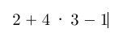
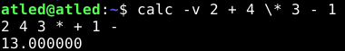

## Infix Command-Line Argument Calculator

**Important: Characters such as '\*', '(', and ')' may need to be escaped in your shell**
_e.g. \\*, \\(, and \\)_

### Usage Examples

* basic expression using verbose "-v" option to display postfix notation

 

