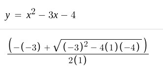
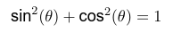
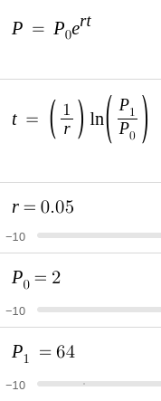
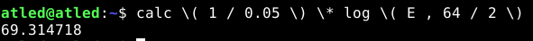

## Infix Command-Line Argument Calculator

**Important: characters such as '\*', '(', and ')' may need to be escaped in your shell**
_e.g. \\*, \\(, and \\)_

### Usage Examples

* Basic expression using verbose "-v" option to display postfix notation

 

* Finding one root of a qudratic expression

* Verifying pythagorean identity

* Get a length of time, given an exponential growth rate, an initial quantity 
and a final quantity

### Build Instructions
