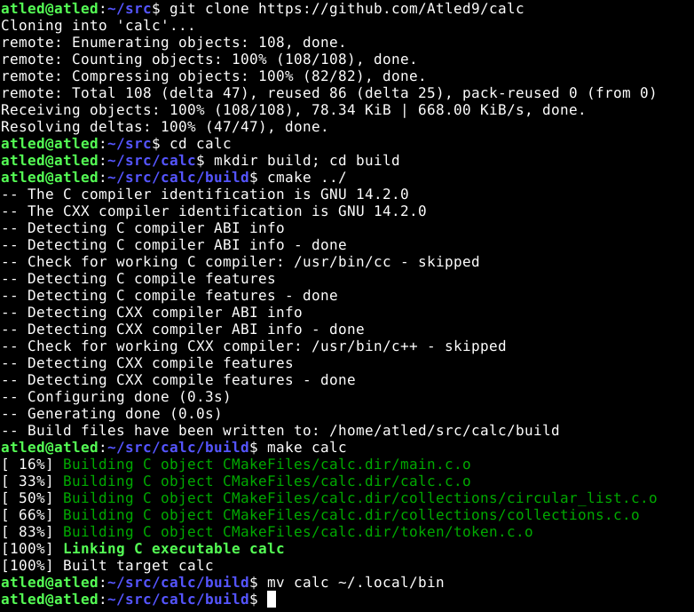

## Infix Command-Line Argument Calculator

**Important: characters such as '\*', '(', and ')' may need to be escaped in your shell**
_e.g. \\*, \\(, and \\)_

### Usage Examples

* Basic expression using verbose "-v" option to display postfix notation

> 

>

* Finding one root of a qudratic expression

>

>

* Verifying pythagorean identity

>

>

* Get a length of time, given an exponential growth rate, an initial quantity 
and a final quantity

>

>

### Build Instructions

* Clone [this](https://github.com/Atled9/calc) repository
> `$ git clone https://github.com/Atled9/calc`
* Enter the cloned repository
> `$ cd calc`
* Make and enter build directory
> `$ mkdir build; cd build`
* Run cmake for CMakeLists.txt file in parent directory
> `$ cmake ../`
* Build "calc" target binary from Makefile
> `$ make calc`
* _Optional: move binary into one of your PATH directories_
> `$ mv calc ~/.local/bin`

## Usage Instructions

* Values are read as doubles and may be input using scientific notation (using e)
* Values must start with:
 * \< a number \>
 * \< sign character \> + \< a number \>
* _Acceptable value entry examples:_
 * 0.1
 * -0.1
 * +0.1
 * 1e-1
* _Unacceptable value entry examples:_
 * .1
 * -.1
 * +.1
 * e-1
* All operands, operators, and function names must be separated by whitespace, including commas and parentheses
* All function parameters must be enclosed in parentheses

* Options:
 * "-p" = postfix: expression will be entered using postfix notation
 * "-v" = verbose: postfix expression will be displayed after infix entry 

* Macro Constants:
 * "PI": pi = 3.141...
 * "E" : euler's number = 2.718...

* Operators:
 * +: addition
 * -: subtraction
 * \*: multiplication
 * /: division
 * %: modulus
 * ^: exponentiation

* Single-parameter functions:
 * sin ( in radians ): sine
 * cos ( in radians ): cosine
 * tan ( in radians ): tangent

* 2-parameter functions:
 * log ( base , argument ): logarithm
 * max ( a , b ): max
 * rand ( low , high ): generate random number in range [low, high)

